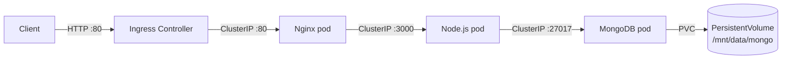
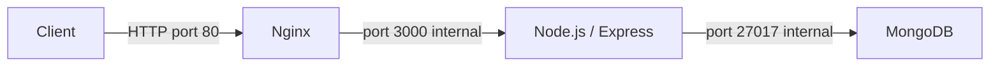
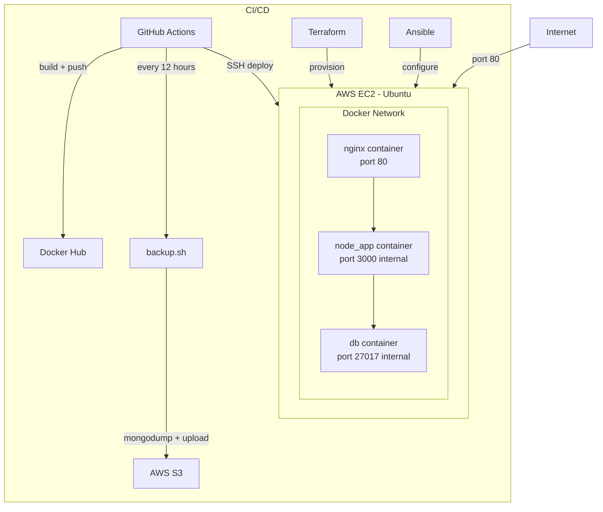

# TodoOps

TodoOps is a containerized Todo REST API built as a full cloud engineering learning project. It was originally deployed on AWS EC2 using Docker Compose, Terraform, Ansible, and GitHub Actions — then migrated to Kubernetes on Minikube to demonstrate container orchestration concepts.

> There is no live deployment currently — the EC2 instance is destroyed. To use the app, run it locally using one of the options below.

## Key Features

- Create, read, update, and delete tasks
- Every task is date-stamped and shows completion status
- Data persisted in MongoDB across container restarts
- Automated database backups every 12 hours to AWS S3 (original EC2 deployment)

## Project Highlights

### Original Deployment (Docker Compose + EC2)
- Multi-container Docker Compose with Nginx reverse proxy
- Infrastructure as Code with Terraform (EC2 + security groups)
- Server configuration with Ansible (Docker, AWS CLI, deploy files)
- CI/CD pipeline with GitHub Actions (build → push → SSH deploy)
- Scheduled database backups to AWS S3 via GitHub Actions

### Kubernetes Migration
- Deployments, Services, ConfigMap, Secrets, Namespace
- PersistentVolume + PersistentVolumeClaim for MongoDB data
- Ingress + Nginx Ingress Controller (replaces NodePort)
- Resource requests and limits on all containers
- Liveness and readiness probes on all containers
- Helm chart packaging (`k8s/todoops-chart/`) for single-command deployment

## Architecture

### Current (Kubernetes)



### Original (Docker Compose on EC2)





## Tech Stack

| Category | Technologies |
|----------|-------------|
| Languages & Frameworks | JavaScript, Node.js, Express, Mongoose |
| Containerization | Docker, Docker Compose |
| Container Orchestration | Kubernetes (Minikube), kubectl, Helm |
| Infrastructure as Code | Terraform, Ansible |
| Cloud & Hosting | AWS EC2, AWS S3 |
| CI/CD | GitHub Actions |
| Database | MongoDB |
| Web Server | Nginx |

## Run Locally

### Option A — Docker Compose (quick)

**Prerequisites:** Docker Desktop

1. Create a `.env` file in the project root:
```
DATABASE_URI=mongodb://db:27017/tododb
```

2. Start the containers (pulls the pre-built image from Docker Hub):
```bash
docker compose up
```

The API will be available at `http://localhost/todos`

---

### Option B — Kubernetes / Minikube (full stack)

**Prerequisites:** Docker Desktop, kubectl, Minikube

1. Start the cluster:
```bash
minikube start --driver=docker
minikube addons enable ingress
```

2. Apply manifests in order:
```bash
kubectl apply -f k8s/namespace.yml
kubectl apply -f k8s/mongo/persistentvolume.yml
kubectl apply -f k8s/mongo/persistentvolumeclaim.yml
kubectl apply -f k8s/mongo/secret.yml
kubectl apply -f k8s/mongo/
kubectl apply -f k8s/nodejs/
kubectl apply -f k8s/nginx/
kubectl apply -f k8s/ingress.yml
```

3. Wait for all pods to be ready:
```bash
kubectl get pods -n development
```

4. Get the cluster IP and hit the API:
```bash
minikube ip
curl http://<minikube-ip>/todos
```

---

### Option C — Helm (single command)

**Prerequisites:** Docker Desktop, kubectl, Minikube, Helm

1. Start the cluster:
```bash
minikube start --driver=docker
minikube addons enable ingress
```

2. Install the chart:
```bash
helm install todoops k8s/todoops-chart
```

3. Wait for all pods to be ready:
```bash
kubectl get pods -n development
```

4. Hit the API:
```bash
curl http://$(minikube ip)/todos
```

To uninstall:
```bash
helm uninstall todoops
kubectl delete pv db-pv
```

> Note: `helm uninstall` removes all namespace-scoped resources but not the PersistentVolume (cluster-scoped). Delete it manually if you want a clean slate.

## Original Cloud Deployment (Archived)

> The EC2 instance is currently destroyed and the GitHub Actions deploy/backup workflows are disabled. This section documents the original deployment pipeline.

### Infrastructure (Terraform)

In `/terraform`, run:
```bash
terraform init
terraform plan
terraform apply
```

### Server Setup (Ansible)

Update `ansible/inventory.ini` with the EC2 IP, then run:
```bash
ansible-playbook -i inventory.ini playbook.yml
```
This installs Docker and the AWS CLI, copies config files, and starts the containers.

### CI/CD (GitHub Actions)

Every push to `main` automatically:
- Builds and pushes the Docker image to Docker Hub
- SSHes into the EC2 and runs `docker compose pull && docker compose up -d`

### Automated Backups

A scheduled GitHub Actions workflow runs every 12 hours and:
- SSHes into the EC2
- Runs `mongodump` inside the MongoDB container
- Compresses the dump into a `.tar.gz` archive
- Uploads it to AWS S3 using the AWS CLI
- Cleans up temporary files

### Required GitHub Secrets

| Secret | Description |
|--------|-------------|
| `DOCKER_USERNAME` | Docker Hub username |
| `DOCKER_PASSWORD` | Docker Hub password |
| `EC2_HOST` | EC2 public IP address |
| `EC2_SSH_KEY` | Private key contents for SSH access |
| `AWS_ACCESS_KEY_ID` | IAM user access key for S3 uploads |
| `AWS_SECRET_ACCESS_KEY` | IAM user secret key for S3 uploads |
| `S3_BUCKET_NAME` | S3 bucket name for storing backups |

## API Endpoints

| Method | Endpoint | Description |
|--------|----------|-------------|
| GET | `/todos` | Get all todos |
| POST | `/todos` | Create a new todo |
| GET | `/todos/:id` | Get a single todo by ID |
| PUT | `/todos/:id` | Update a todo by ID |
| DELETE | `/todos/:id` | Delete a todo by ID |

### Example Request

**POST** `/todos`
```json
{
  "todo": "my first task"
}
```

**Response**
```json
{
  "success": "New task my first task created!"
}
```
