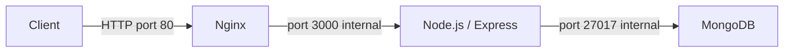
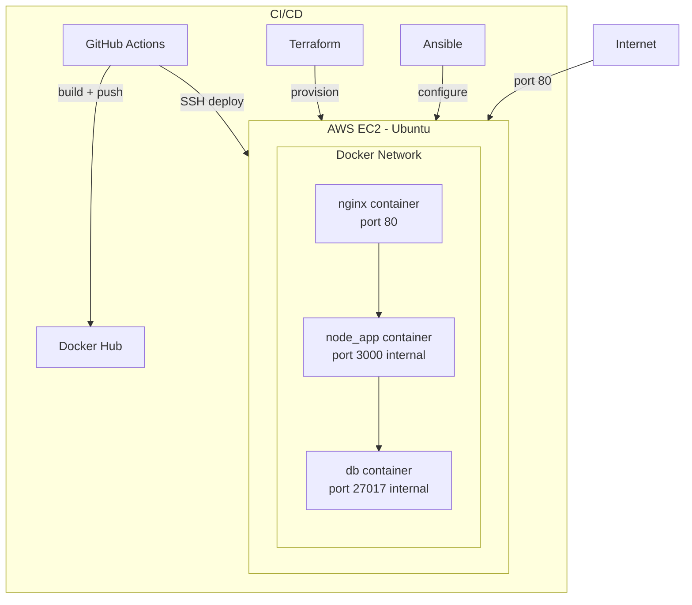

# TodoOps
TodoOps is a containerized Todo REST API deployed on AWS EC2. It demonstrates a full cloud deployment pipeline — from infrastructure provisioning with Terraform and Ansible to automated deployments via GitHub Actions, all running behind an Nginx reverse proxy.

## Key Features

- Create, read, update, and delete your tasks
- Every task is date-stamped and shows completion status
- Your list is saved on a cloud database

### Cloud Highlights

- Full REST API with MongoDB
- Multi-container Docker Compose
- Infrastructure as Code with Terraform
- Configuration management with Ansible
- CI/CD pipeline with GitHub Actions
- Nginx reverse proxy

## Architecture



## Infrastructure


## Tech Stack

| Category | Technologies |
|----------|-------------|
| Languages & Frameworks | JavaScript, Node.js, Express, Mongoose |
| Containerization | Docker, Docker Compose |
| Infrastructure as Code | Terraform, Ansible |
| Cloud & Hosting | AWS EC2 |
| CI/CD | GitHub Actions |
| Database | MongoDB |
| Web Server | Nginx |

## Prerequisites
- Docker Desktop
- Terraform
- Ansible
- AWS CLI + Credentials
- Node.js (if running without Docker)

## Local Development - Run with Docker Compose
1. Create a '.env' file in the project root:
DATABASE_URI=mongodb://db:27017/tododb
PORT=3000
DOCKER_USERNAME=your-dockerhub-username

2. Start up the containers
``` bash
docker compose up --build
```
The API will be available at `http://localhost:3000/todos`

## Deployment
1. Create an EC2 Instance with Terraform. In `/terraform`, run:
``` bash
terraform init
terraform plan
terraform apply
```
2. Update `ansible/inventory.ini` with the EC2 IP

3. Setup EC2 server with Ansible. In `/ansible`, run:
``` bash
ansible-playbook -i inventory.ini playbook.yml
```
This installs Docker, copies config files, and starts the containers.

### CI/CD
Every push to `main` automatically:
- Builds and pushes the Docker image to Docker Hub
- SSHs into the EC2 and runs `docker compose pull && docker compose up -d`

The following GitHub Secrets are required:

| Secret | Description |
|--------|-------------|
| `DOCKER_USERNAME` | Docker Hub username |
| `DOCKER_PASSWORD` | Docker Hub password |
| `EC2_HOST` | EC2 public IP address |
| `EC2_SSH_KEY` | Private key contents for SSH access |

## API Endpoints

| Method | Endpoint | Description |
|--------|----------|-------------|
| GET | `/todos` | Get all todos |
| POST | `/todos` | Create a new todo |
| GET | `/todos/:id` | Get a single todo by ID |
| PUT | `/todos/:id` | Update a todo by ID |
| DELETE | `/todos/:id` | Delete a todo by ID |

### Example Request

**POST** `/todos`
```json
{
  "todo": "my first task"
}
```

**Response**
```json
{
  "success": "New task my first task created!"
}
```